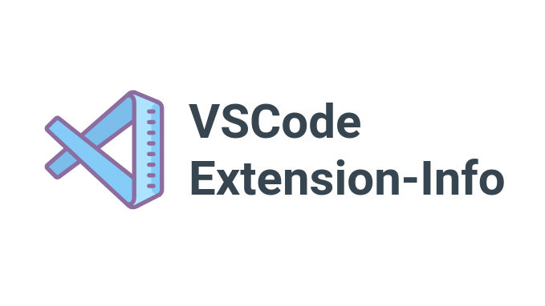

# [vscode-extension-info ](https://www.npmjs.com/package/vscode-extension-info)

**vscode-extension-info** is a command-line tool for managing and updating Visual Studio Code extensions. It allows you to update all installed extensions or selectively update specific ones. Retrieve information about installed extensions including names, versions, publishers, descriptions, dates, sizes, URLs, and more.


## Features

- User-friendly command-line interface: Simple and intuitive commands for displaying information about extensions.
- Designed to work on multiple platforms, including Windows, Linux, and macOS. you can rely on the **vscode-extension-info** tool to manage and update your extensions seamlessly.
- Display information about installed extensions like extension names, versions, publishers, descriptions, installation dates, sizes, marketplace URLs, and more.
- Works offline: No internet connection is required for retrieving installed extension information.
- Fast and efficient: Updates extensions in a streamlined manner.
- Update all installed extensions to the latest version with a single command.
- Supports extension-specific updates: Update only the extensions you want, minimizing unnecessary updates.

## Installation
```
 npm i -g vscode-extension-info
```
## Usage

> *" You can use the shorthand command **vs-ext-i** instead of **vscode-extension-info** for convenience. "*

---
- **vs-ext-i < extension-id > [options]**    Search and display information for a specific extension.
- **vs-ext-i [options]**                   Search and display information for all extensions.
---

**vscode-extension-info** ( vs-ext-i ) provides several options to customize the output and behavior. Some of the available options include:
### Options :
- `--name`: Display extension names.
- `--ext-version`: Display extension versions.
- `--description`: Display extension descriptions.
- `--date`: Display installation dates of extension.
- `--id`: Display extension IDs.
- `--url`: Display marketplace URLs.
- `--size`: Display extension sizes.
- `--repo`: Display extension repositories.
- `--keywords`: Display extension keywords.
- `--license`: Display extension licenses.
- `--deps`: Display extension dependencies.
- `--vscode-ver`: Display VS Code versions for the extension.
- `--homepage`: Display extension homepages.
- `--bugs`: Display extension bug URLs.
- `--author`: Display extension author info.
- `--all`: Display all available data.
- `--help`: Display all available data about options to help the user.
- `--update`:         Update the extension to the latest versions.
- `--version` or `-v`:  Display vscode-extension-info current version.

### Examples:
- Display all extensions names, descriptions, and IDs:
```
 vs-ext-i --name --description --id
```
- Update all extensions :
```
 vs-ext-i --update
```

- Display a specific extension name, description, and ID:
```
 vs-ext-i < extension-id > --name --description --id
```
- Update a specific extension :
```
 vs-ext-i < extension-id > --update
```
## Author

The **vscode-extension-info** tool is developed and maintained by **[Khaled Nassar](https://github.com/khalednassar500)**.

### Contributors

- Osama Soliman [GitHub](https://github.com/solimanware)
## License

The **vscode-extension-info** tool is licensed under the [MIT License](https://opensource.org/licenses/MIT). See the [LICENSE](/LICENSE.txt) file for details.


